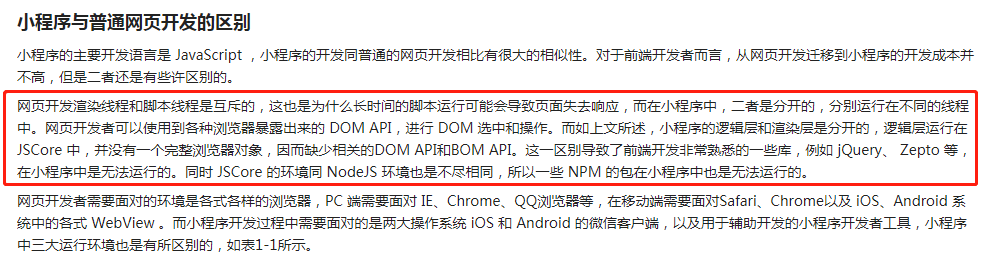
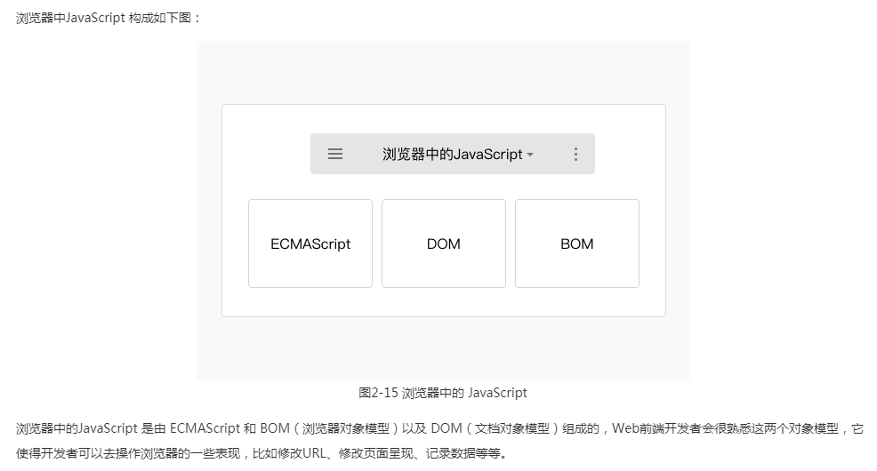
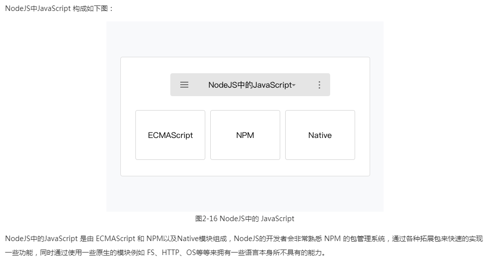
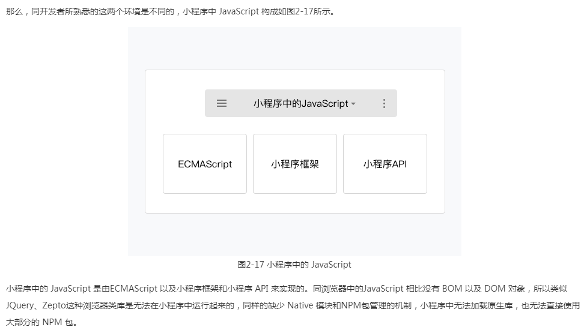
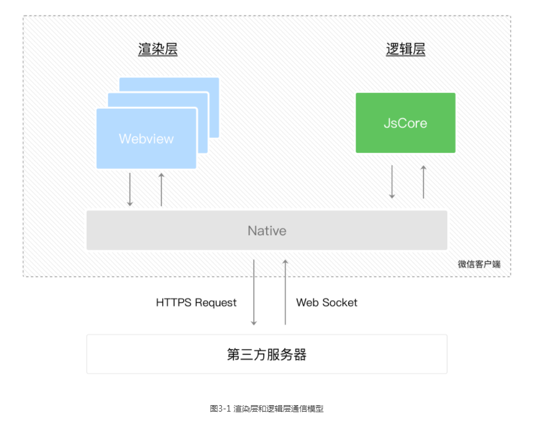

# 小程序分析

> 看小程序开发文档介绍可知

- 1.小程序用 js 作为开发语言，但是 js 是运行在小程序框架的逻辑层的 JsCore 内，无法操作浏览器的 dom。

# BIM 引擎 sdk 分析

- 1.sdk 使用 js 开发
- 2.sdk 运行查看模型图纸，有内置 UI 功能。这些是通过 H5 操作 dom 直接生成功能界面。

# 需求分析

- 使用小程序提供的本地数据缓存功能，来实现小程序的离线，并且实现小程序里离线查看 sdk 提供的模型图纸渲染功能。

# 方案分析

- 1.重构原有的 UI 功能部分，不在 sdk 里直接操作 dom 生成 UI 功能，sdk 只提供渲染加载和 api 接口，由小程序里自己写 UI 交互功能（工作量很大，sdk 内部抽离 API 接口，使用方写大量的 UI 界面操作交互）

- 2.参考微信小程序官方提供的 three 适配的库，进行 sdk 里的 canvas 适配

- 3.sdk 实现加载本地资源的流程

# 总结

- 1.如果不实现 UI 功能，只提供 api 接口，脱离了原本的设计原则（原则：供第三方快速接入 sdk 预览查看模型图纸及相关界面功能，不用花费大量时间开发功能）

- 2.进行微信小程序的 canvas 适配意义不大，可能在百度小程序，支付宝小程序里就无法使用。

- 3.sdk 实现本地加载资源进行渲染的功能可以研究实现。js 无法自动获取本地资源文件（安全性限制），需要 input='type'按钮来手动选择文件进行文件读取。第二种通过外部缓存文件，然后通过接口传递文件流进行加载。（最优）
