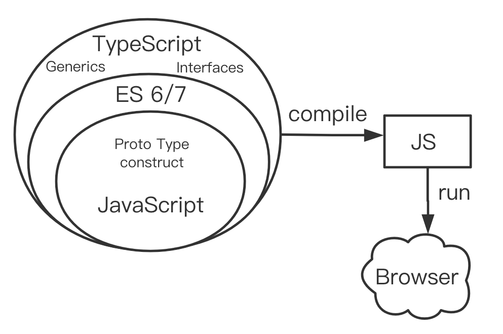

**原文**

```
  魏文王问扁鹊曰：「子昆弟三人其孰最善为医？」

  扁鹊曰：「长兄最善，中兄次之，扁鹊最为下。」 

  魏文王曰：「可得闻邪？」

  扁鹊曰：「长兄於病视神，未有形而除之，故名不出於家。中兄治病，其在毫毛，故名不出於闾。若扁鹊者，鑱血脉，投毒药，副肌肤，闲而名出闻於诸侯。」
```

**译文**

```
  扁鹊是尽人皆知的神医，但很多人并不知道扁鹊的两个哥哥也颇懂医理。

  一天，魏文王问扁鹊：“你们家兄弟 三人，都精于医术，到底哪一位最好呢 ? ” 

  扁鹊答：“我的大哥医术最好，二哥次之，我最差。” 

  文王再问：“那么为什么你最出名呢 ? ” 

  扁鹊答道：“我大哥治病，是治病于病情发作之前的时候，由于一般人不知道他能事先铲除病因，反而觉得他的治疗没什么明显的效果，所以他的名气无法传出去，只有我们家的人才知道。我二哥治病，是治病于病情初起的时候，看上去以为他只能治轻微的小病，所以他的名气只能在我们乡里流传。而我扁鹊治病，是治病于病情已经严重的时候。一般人看到我在经脉上穿针放血，在皮肤上敷药，用麻药让人昏迷，做的都是些不可思议的大手术，自然以为我的医术高明，因此名气响遍全国，远远大于我的两位哥哥。” 

```

> 事后控制不如事中控制，事中控制不如事前控制，写代码也是，要把 bug 扼杀在摇篮里。

1.原始数据保持不变（不对原始数据进行处理）。如果要使用数据最好重新生成一份有用字段的数据，后端返回的数据有些字段对前端来说是无效的。

# 核心篇

## 1.信手拈来

接到开发需求后，不假思索，马上动手，直接堆代码，边写边理解需求边改代码。最后写完 bug 很多，只考虑当前，只想到眼前看到的。

### 如何三思而后行

1.接到需求后，先花时间充分理解需求，判断需求合理性，设计规划整理思路，熟练的在脑子里想，不熟练的拿笔写下来，画下来。

2.把需求逻辑整理成代码逻辑，设计相关代码实现。

3.联想这个需求的相关需求，后续的需求变更，设计代码的可扩展性。

## 2.拒绝使用 TS

不用 ts 写类型，就没有很多限制，自己感觉写的很爽，第二天来看，这啥啊，怎么会报错。一个星期后来维护，纳尼？对 ts 很排斥，各种限制写起来很不舒服，难以接受。

### TS 的好处



1.类型的定义，和编译器的代码校验，可使 js 代码更加规范，更具可读性，更容易排查错误。

2.要用好 TS，不是无脑的 any

## 3.不进行模块抽象和复用

功能都从 0 开始实现，不抽象任何公共组件，不把高频出现的逻辑抽象，不抽象出工具函数，坚决不复用任何逻辑。

### 导致的问题

会导致代码冗余会越来越多，以后需要修改一个业务需求，需要改好几处地方。

### 如何进行模块抽象

TODO

# 前端框架篇
